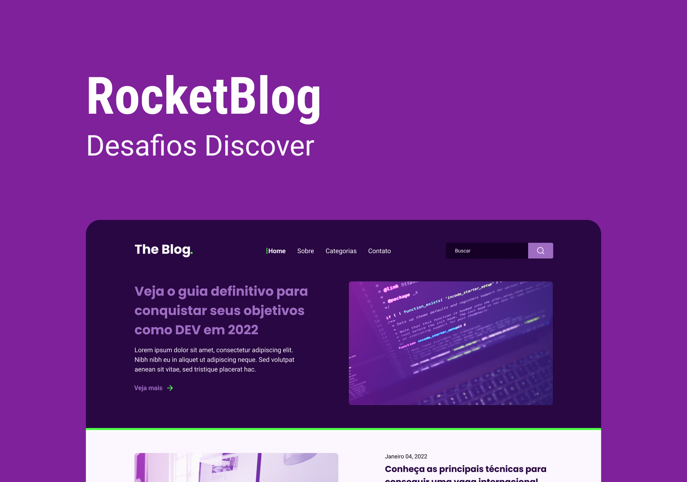

# Rocket Blog

## Descrição

O Rocket Blog é um projeto de homepage para um blog

## Tabela de Conteúdos

- [Tecnologias](#tecnologias)
- [Projeto](#projeto)
- [Rodar Código](#como-rodar-o-código-na-sua-máquina)

## 🚀 Tecnologias

Esse projeto foi desenvolvido com as seguintes tecnologias:

- HTML
- CSS
- Git
- GitHub

## 💻 Projeto

Um projeto de homepage para um blog

## Como rodar o código na sua máquina

To run this code in your machines follow the steps below:

- run in your terminal: git clone https://github.com/Sarah-Ribeiro/meu-portfolio

- Then go to the folder: cd meu-portfolio

- Run the live server in the about.html

- HAVE FUN!

---

Feito com ♥ by Sarah Ribeiro
